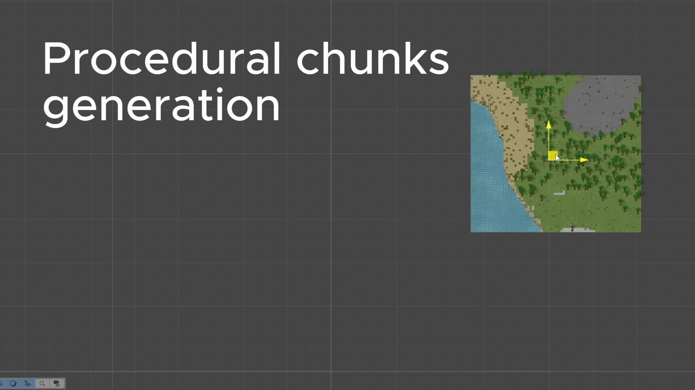

# Procedural_chunks_generation
Wrote this a couple years back for a 2D Unity project. Open-sourcing it to show my implementation of chunk streaming and noise-based biomes.

**Chunk Streaming**
The map is split into a localized grid. As the player moves, `Map.cs` calculates spatial distance, destroying chunks which are too far to free memory and pushing new coordinates to a load queue. A Coroutine processes this queue to distribute the load and prevent main thread spikes. Loaded chunks are tracked using a `HashSet<Vector3Int>`.

**Noise & Biomes**
The procedural math is handled in `NoiseGenerator.cs`, which generates the Perlin noise arrays for height, moisture, and heat. The map script evaluates these combined float values per-tile against `BiomePreset` ScriptableObjects to determine the terrain layout. The `BiomePreset` stores the rules for foliage, entities, and ores, which get their independent noise passes. Any runtime modifications to the tiles are saved when the chunk unloads.

(1).gif)
